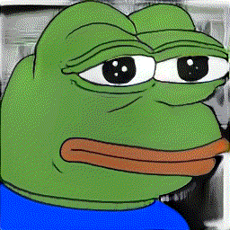
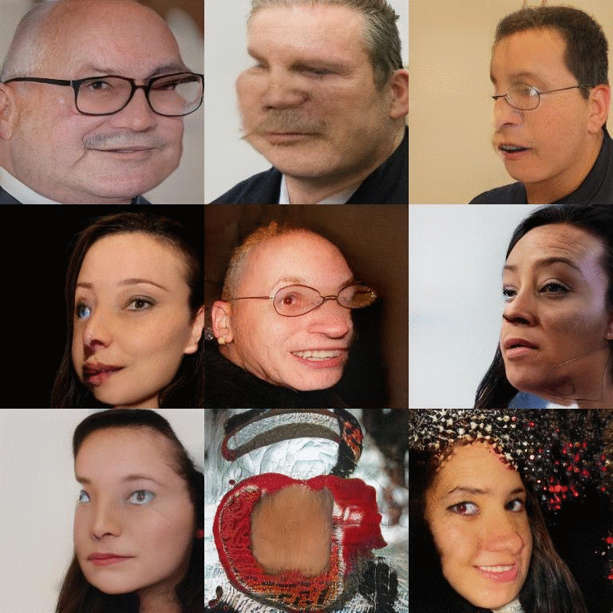

# Selfie to pepe (ODS pet project hackathon)

##### [telegram: @ods_sticker_pack_bot](https://t.me/ods_sticker_pack_bot) | [pepe datasets](https://drive.google.com/drive/folders/1A5lvBdknNP2qZ8ySwV7u-gbZA7graSsE?usp=sharing)

 Send your selfie and get pepe version of yourself

### Example

<div>
    <table>
        <tr>
            <td>
                <h2>Selfie input</h2>
            </td>
            <td>
                <h2>Pepe output</h2>
            </td>
        </tr>
        <tr>
            <td></td>
            <td></td>
        </tr>
    </table>    
</div>


## How it works
* We detect the face on the image via `dlib` library then align and reshape it
* We apply [pix2pix model](https://github.com/junyanz/pytorch-CycleGAN-and-pix2pix) to generate the output image.

## How it was trained
##### 1 Step
Using the results of the paper
["Differentiable Augmentation for Data-Efficient GAN Training"](https://hanlab.mit.edu/projects/data-efficient-gans/)
and code from [their repo](https://github.com/mit-han-lab/data-efficient-gans) we train 300-shot model on pepe images.


  

 *thispepedoesntexist*
 
 
 
 1. to generate random selfies on dataset [CelebA](http://mmlab.ie.cuhk.edu.hk/projects/CelebA.html)
 2. To generate random [pepe images](https://drive.google.com/file/d/1kihnhn8UaUE0VTw9unEZKKpRBgPCCH4w/view?usp=sharing)
 
 
Training DiffAugment-stylegan2 need approx. 100 or little more dataset samples of selected domain.
 
By replacing latent vectors in model 2 by latent vectors in 1 model you can get peoples
 more and more similar to Pepe:
 
 


Also by replacing latent vectors in model 1 by latent vectors in 2 model you can transform pepe to human style:
 
 



Then you should train model StyleGan2 on 
[colab notebook](https://colab.research.google.com/drive/1s2XPNMwf6HDhrJ1FMwlW1jl-eQ2-_tlk?usp=sharing) 
to generate from your selfie nearest selfie from StyleGan. You should bring from this model latent vector 
with your image and paste to model that generates Pepe image.

After that you generate DiffAugment-stylegan2 model Pepe image that generated from your selfie.


## Pepe dataset

 - [365 good Pepe pics](https://drive.google.com/file/d/1kihnhn8UaUE0VTw9unEZKKpRBgPCCH4w/view?usp=sharing)
 - [3000 pictures with Pepe, including some not Pepe pics](https://drive.google.com/file/d/1It0uWyf0lgqPMSSkUeXzkIPGd8JXKyJA/view?usp=sharing)

## Requirements
 - Pillow
 - python-telegram-bot
 - numpy
 - opencv-python
 - dlib
 - scipy
 - torch
 - torchvision
 - albumentations
 
 
 
## Run telegram bot on server 
 ```shell
 $ python3 custom_bot.py
```
